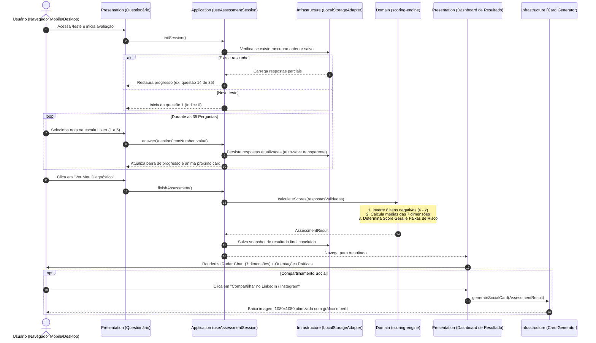

# Engenharia e Arquitetura de Software — Antes do Burnout

> **Projeto:** Antes do Burnout (Avaliação Psicossocial Individual B2C)  
> **Papel:** Documento de Diretrizes e Arquitetura de Software  
> **Padrão:** Clean Architecture / Domain-Driven Design (DDD) aplicado ao Frontend  
> **Status:** Homologado para Desenvolvimento  

---

## 1. Filosofia de Engenharia e Princípios Arquiteturais

O **Antes do Burnout** não é tratado como um simples questionário estático, mas como um **sistema de diagnóstico psicométrico modular, desacoplado e escalável**.

Para garantir manutenibilidade a longo prazo, confiança nos dados científicos e flexibilidade para monetização futura, seguimos princípios de engenharia consolidados:

```
┌────────────────────────────────────────────────────────────────────────┐
│                        ARQUITETURA EM 4 CAMADAS                        │
│                                                                        │
│  [1] DOMAIN (Core Puro)       -> 0 dependências externas (agnóstico)   │
│  [2] APPLICATION (Casos)      -> State Machine, Storage, Recomendações │
│  [3] INFRASTRUCTURE (I/O)     -> Gateways Pix, PDF Engine, Analytics   │
│  [4] PRESENTATION (UI/Next.js)-> Next.js 15, Tailwind, Recharts, Framer│
└────────────────────────────────────────────────────────────────────────┘
```

### 1.1 Domínio Puro e Agnóstico (Zero Dependências Externas)
O núcleo psicométrico (`domain/`) não possui nenhuma dependência do React, do Next.js, do DOM do navegador ou de qualquer biblioteca externa. É constituído por **funções puras, determinísticas e imutáveis**.
* **Benefício:** Pode rodar no navegador, em Node.js, em workers serverless ou ser empacotado como uma biblioteca npm independente sem alterar uma única linha de código.

### 1.2 Separação de Preocupações (Separation of Concerns)
A lógica de cálculo nunca sabe como o dado é desenhado na tela; o gráfico de radar nunca sabe como a média foi calculada; a interface do usuário nunca acessa diretamente o `localStorage` ou APIs de rede sem passar pelos adaptadores e casos de uso.

### 1.3 Resiliência e Tolerância a Falhas na Sessão do Usuário
Responder 35 perguntas exige foco e tempo do usuário (3 a 5 minutos). 
* **Regra de Ouro da UX:** O usuário nunca pode perder o progresso se a aba do celular fechar, se a conexão oscilar ou se a página for recarregada. O estado da avaliação é sincronizado de forma transparente via adaptador de armazenamento local (*auto-save*).

### 1.4 Fail-Fast e Integridade com Tipagem Estrita
Todas as entradas do usuário e payloads de respostas são validados na borda da aplicação (via TypeScript e schemas de validação). Valores inválidos (ex: notas fora do intervalo 1 a 5 ou chaves inexistentes) são barrados antes de atingir o algoritmo psicométrico.

### 1.5 Privacidade por Design (Privacy-First / LGPD)
O cálculo e a exibição do diagnóstico operam integralmente no navegador do cliente (*client-side*). Nenhum dado pessoal identificável (PII) é transmitido, garantindo confidencialidade médica/psicológica sem risco de vazamentos.

---

## 2. As Quatro Camadas do Sistema

### Camada 1: `Domain` (Núcleo Psicométrico Puro)
Contém as entidades, tipos canônicos e regras matemáticas da metodologia UK HSE-IT.

* **Responsabilidades:**
  * Catálogo oficial imutável das 35 perguntas.
  * Inversão determinística de pontuação dos 8 itens formulados negativamente ($6 - x$).
  * Cálculo de médias das 7 dimensões e média global.
  * Classificação em faixas de corte normativas:
    * Verde ($\ge 4{,}00$ — Baixo Risco / Protetivo)
    * Âmbar ($3{,}00 \le X < 4{,}00$ — Risco Moderado / Atenção)
    * Vermelho ($< 3{,}00$ — Risco Crítico / Ação Imediata)
  * Mapeamento de percentis em relação ao benchmark oficial do UK HSE (P20, P50, P80).
* **Artefatos:** `src/domain/catalogo-hse.ts`, `src/domain/scoring-engine.ts`, `src/domain/classification.ts`, `src/domain/benchmarks.ts`, `src/domain/types.ts`.

### Camada 2: `Application` (Casos de Uso e Orquestração de Estado)
Coordena as ações que o usuário realiza no sistema e mantém a máquina de estados da sessão.

* **Casos de Uso Principais:**
  * `useAssessmentSession`: Máquina de estados que gerencia a pergunta ativa (índice 0 a 34), o mapa de respostas já preenchidas, cálculo de percentual de conclusão e recuperação de rascunhos.
  * `RecommendationService`: Traduz os scores numéricos de cada dimensão em diagnósticos compreensíveis e planos de ação individuais de enfrentamento (*coping* e comunicação assertiva com a liderança).
  * `ShareOrchestrator`: Prepara os dados consolidados para alimentar o gerador de imagem para redes sociais.
* **Artefatos:** `src/application/use-assessment-session.ts`, `src/application/recommendation-service.ts`, `src/application/share-orchestrator.ts`.

### Camada 3: `Infrastructure` (Adaptadores de I/O e Integrações Externas)
Conecta a aplicação a recursos do ambiente externo (armazenamento, renderização de mídia e rede).

* **Responsabilidades:**
  * `storage/local-storage-adapter.ts`: Leitura e escrita segura do estado com fallback gracioso em ambientes privados.
  * `image/canvas-card-generator.ts`: Pipeline de geração de imagem 1080x1080 (Canvas / `html-to-image`) com metadados para download instantâneo.
  * `pdf/pdf-engine.ts` *(Fase 2)*: Geração do laudo individual detalhado para download.
  * `payment/pix-client.ts` *(Fase 2)*: Integração de webhook e QR Code Pix para micro-transações do relatório premium.
* **Artefatos:** `src/infrastructure/storage/`, `src/infrastructure/image/`, `src/infrastructure/export/`.

### Camada 4: `Presentation` (Interface e Experiência do Usuário)
Responsável pela visualização, acessibilidade e interatividade no ecossistema Next.js 15.

* **Responsabilidades:**
  * Renderização de rotas pelo App Router (`/`, `/teste`, `/resultado`, `/metodologia`).
  * Design System baseado em Tailwind CSS e primitivos acessíveis do Radix UI (`shadcn/ui`).
  * Visualização de dados científicos com **Recharts**:
    * `RadarChartHse`: Gráfico de teia com as 7 dimensões polares.
    * `RiskGauge`: Termômetro / medidor visual circular da nota geral.
  * Transições suaves de cartões do questionário via **Framer Motion**.
* **Artefatos:** `src/presentation/components/`, `src/presentation/hooks/`, `src/app/`.

---

## 3. Ciclo de Vida da Avaliação e Fluxo de Dados

O diagrama abaixo ilustra o fluxo completo desde o clique inicial do usuário até a exibição do dashboard e compartilhamento do diagnóstico:



---

## 4. Estrutura Canônica de Pastas do Projeto

A organização de pastas reflete estritamente a separação em camadas proposta:

```
antes-do-burnout/
├── docs/                             # Dossiê normativo, metodologia e decisões técnicas
│   ├── 00-catalogo-35-perguntas.json
│   ├── 01-metodologia-hse-it.md
│   ├── 02-motor-psicometrico-referencia.py
│   ├── 03-catalogo-orientacoes-e-intervencoes.py
│   ├── 04-testes-psicometricos-referencia.py
│   ├── ESTRATEGIA_PRODUTO_E_MONETIZACAO.md
│   ├── STACK_TECNICA.md
│   └── ARQUITETURA_DE_SOFTWARE.md    # Este documento
│
├── src/
│   ├── domain/                       # [CAMADA 1: CORE PSICOMÉTRICO PURO]
│   │   ├── types.ts                  # Tipos TypeScript canônicos (Item, Dimension, Score)
│   │   ├── catalogo-hse.ts           # 35 perguntas oficiais (dados imutáveis)
│   │   ├── scoring-engine.ts         # Cálculo determinístico, reverse scoring (6-x)
│   │   ├── classification.ts         # Enquadramento em Verde / Âmbar / Vermelho
│   │   ├── benchmarks.ts             # Tabela percentílica do UK HSE
│   │   └── scoring-engine.test.ts    # Testes unitários com 100% de cobertura
│   │
│   ├── application/                  # [CAMADA 2: CASOS DE USO E ESTADO]
│   │   ├── use-assessment-session.ts # Hook / Store da sessão ativa com auto-save
│   │   ├── recommendation-service.ts # Tradução dos scores em planos de ação individuais
│   │   └── share-orchestrator.ts     # Preparação de dados para cards sociais
│   │
│   ├── infrastructure/               # [CAMADA 3: ENTRADA/SAÍDA & ADAPTADORES]
│   │   ├── storage/
│   │   │   └── local-storage-adapter.ts # Persistência segura no navegador
│   │   ├── image/
│   │   │   └── canvas-card-generator.ts # Geração do card 1080x1080 para redes
│   │   └── export/                   # Futuro motor de geração de PDF e Pix
│   │
│   ├── presentation/                 # [CAMADA 4: INTERFACE DO USUÁRIO]
│   │   ├── components/
│   │   │   ├── ui/                   # Primitivos shadcn/ui (Button, Card, Badge, Progress)
│   │   │   ├── layout/               # Header, Footer, Container, ThemeToggle
│   │   │   ├── questionnaire/        # QuestionCard, LikertScale, Stepper, TimerBadge
│   │   │   ├── charts/               # RadarChartHse, RiskGauge, DimensionBar
│   │   │   └── share/                # Modal de compartilhamento e preview do card
│   │   └── hooks/                    # Hooks de suporte à UI (useMediaQuery, etc.)
│   │
│   └── app/                          # Next.js 15 App Router (Páginas, SEO e SSR)
│       ├── layout.tsx                # Shell raiz, fontes, metatags OpenGraph
│       ├── page.tsx                  # Landing page de alto impacto e início do teste
│       ├── teste/
│       │   └── page.tsx              # Tela do questionário com animações de transição
│       ├── resultado/
│       │   └── page.tsx              # Dashboard executivo com Radar e Diagnóstico
│       ├── metodologia/
│       │   └── page.tsx              # Página institucional com embasamento científico
│       └── api/                      # Futuros webhooks de pagamento e rotas serverless
│
├── public/                           # Assets estáticos, logos, badges e favicon
├── tests/                            # Testes de integração e ponta a ponta (E2E)
├── package.json
├── pnpm-lock.yaml
├── tailwind.config.ts
└── tsconfig.json
```

---

## 5. Estratégia de Testes e Garantia de Qualidade

Para garantir que nenhuma alteração de interface ou refatoração comprometa a integridade matemática do teste, adotamos uma pirâmide de testes estruturada:

1. **Testes Unitários de Domínio (Vitest):**
   * Cobertura de 100% sobre `src/domain/scoring-engine.ts`.
   * Casos de borda: todas as notas 5 (testando reversão), todas as notas 1, ambiente saudável ideal, e verificação de rejeição de notas inválidas (notas $\le 0$, notas $> 5$ e itens faltantes).
   * **Paridade obrigatória:** Cada teste em TypeScript deve refletir exatamente o comportamento validado no arquivo canônico [`docs/04-testes-psicometricos-referencia.py`](04-testes-psicometricos-referencia.py).
2. **Testes de Casos de Uso (Application Layer):**
   * Validação da máquina de estados do questionário: avanço de perguntas, recuo para alterar nota anterior, recálculo dinâmico do percentual de progresso e persistência no mock de `localStorage`.
3. **Testes de Integração e E2E (Playwright):**
   * Simulação da jornada completa do usuário: navegação da landing page $\rightarrow$ resposta das 35 perguntas $\rightarrow$ renderização correta do Gráfico de Radar e dos cards de recomendação.
